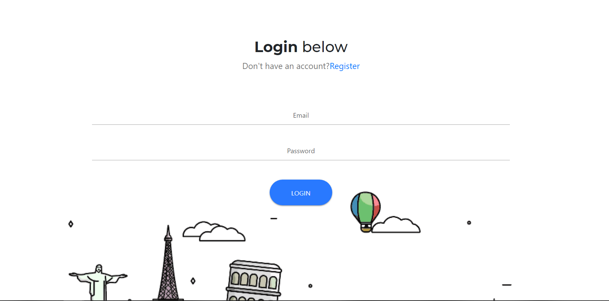

Hello World

# Project Overview
Hello World is a full stack application running working under the MERN stack, using Firebase authentication for user sign in. The goal of Hello World is to create an a different kind of travel experience for anyone traveling the world. With Hello World anyone can connect with a local guide in the aread they wish to visit, and experience that authentic native local experience.

# Issues or other things to add
* Currently in the state that the app is in a guide can only be a guide for one location. Allowing guides to be in multiple locations on one account is a feature are looking to add in a later version. 
* In an earlier build of the app we had Kayak integration so users could search for flights on our app, this had to be dropped due to time constraints and efforts needed to be diverted to other tasks
* We had a bit of a hard time at first creating user authentication using passport, which got scrapped part way through early devolopemtn in favor of Firebase authentication
* Currently once a user creates a voyage its locked in and cannot be edited. 

# Getting Started
A test account is available is you just want to play in the app without signing up:
```
email: test@test.com
pw: 123456
```

# User Experience
## 1. Sign Up

Once a user arrived to the landing page they will need to sign in/sign up 




After sign up users will be taken to the Home page where they can begin creating Voyages. 

## 2. Voyages


On the home screen a user can click on the Create Voyage button below their name this will redirect them to the Voyage creation page. Here they will be promted to fill out the form that will be sent to their guide, on the form they will first be promted to enter a location, once they enter a location this will load all guide in near or experts in that region. 


Once a user selects a location they will see every guide that is familiar with that location as well as the going rate for that guides services and their expertise, like food or architecture, which they can then decide if this lines up with what they want for in their trip. Once the Voyage form is filled it is created and sent to the guide that was chosen, this will then redirect the user to the chat page where they can chat with their guide, or they can go to their home page where they will see their active Voyages on the bottom. The Voyage will list the city where they wish to go and a short description below it to better identify the Voyage in case of multiple trips to the same location. 


## 3. Communicating with Guides
On the home page a user can click on their current Voyage this will take the user to a 1 on 1 chat page that will connect them with their guide. 

```
picture to follow
```
On the page will also be the Voyage in question so both the user and guide can reference it and coordinate the trip. 


# Built With
* Mongo
* Express
* React
* Node.js
* Firebase
* Google Maps

NPMs
1. animate.css: https://www.npmjs.com/package/animate.css
1. axios: https://www.npmjs.com/package/axios
1. concurrently: https://www.npmjs.com/package/concurrently
1. if-env: https://www.npmjs.com/package/if-env
1. mongoose: https://www.npmjs.com/package/mongoose 
1. nodemon: https://www.npmjs.com/package/nodemon
1. react-bootstrap: https://www.npmjs.com/package/react-bootstrap
1. react-dom: https://www.npmjs.com/package/react-dom
1. react-router: https://www.npmjs.com/package/react-router
1. react-router-dom: https://www.npmjs.com/package/react-router-dom
1. react-scripts: https://www.npmjs.com/package/react-scripts

Author:
* Ben DeLong - bdeLong/github. email: bendelong45@gmail.com
* Hugo Villalobos - erithr/github. email: vshugo08@gmail.com
* Sergio Ontiveros - sergio23jr. email: sergio23jr@gmail.com
* Edgar Reynaga - Ticola. email: ticola.space@gmail.com
